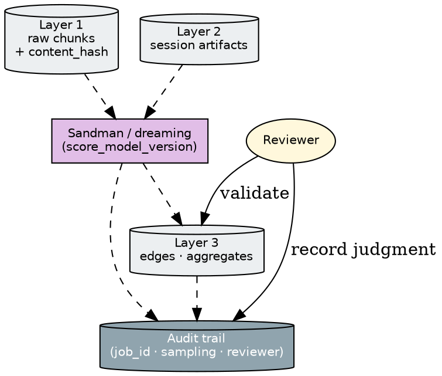

# OmniKB / VectorDB-Brain Architecture (Graphviz)

This page provides **Graphviz DOT source** for system architecture: today’s runtime plus the **planned three-layer model** (Layer 1 raw read-only, Layer 2 session read-write, Layer 3 persistent relationship/consistency graph), **Sandman LLM** orchestrating post-session “dreaming,” human-in-the-loop validation, and drill-down audit trails.

For narrative detail see [layered-knowledge-architecture.md](layered-knowledge-architecture.md) and [implementation-roadmap-layered-architecture.md](implementation-roadmap-layered-architecture.md).

## Conceptual anchor (1945)

Van Bush’s *As We May Think* (1945) describes associative trails linking documents—an early vision of **hybrid knowledge** through navigable relationships rather than isolated retrieval. OmniKB’s Layer 3 graph and drill-down paths align with that intent (implemented with vectors, chunks, and explicit provenance).

## Legend

| Element | Meaning |
|--------|---------|
| **Solid edges** | Synchronous request/data flow (HTTP, direct reads/writes). |
| **Dashed edges** | Background/async jobs (dreaming, promotion cadence). |
| **Box** | Process or service (FastAPI route, ingestion, query, embedder). |
| **Cylinder** | Data store or durable layer (filesystem corpus, Qdrant, planned Layer 2/Layer 3 stores). |
| **Ellipse** | Human actor (operator, reviewer). |
| **Diamond** | Event or trigger (session end, job enqueue). |
| **Clusters** | Logical grouping; **cluster_current** is implemented today; others are planned unless noted. |

## Render locally

```bash
dot -Tsvg docs/architecture-graphviz.dot -o docs/architecture-graphviz.svg   # optional; repo ships DOT inline below only
```

Copy the DOT block below into `architecture-graphviz.dot` if you prefer a standalone file, or paste into [Graphviz Online](https://dreampuf.github.io/GraphvizOnline/).

## Primary architecture diagram (DOT)

```dot
digraph OmniKB_Architecture {
  graph [
    rankdir=LR;
    splines=ortho;
    compound=true;
    fontsize=11;
    fontname="Helvetica";
    labelloc=t;
    label="OmniKB / VectorDB-Brain — current + planned layers";
  ];
  node [fontname="Helvetica"; fontsize=10];
  edge [fontname="Helvetica"; fontsize=9];

  /* ---------- Styles ---------- */
  node [shape=box; style=filled; fillcolor="#E8F4FC"];
  edge [color="#333333"];

  /* ---------- Human / UI ---------- */
  subgraph cluster_ui_validation {
    label="Clients & human-in-the-loop (planned validation UI)";
    style=filled;
    fillcolor="#F5F5F5";
    color="#888888";

    User [shape=ellipse; label="User\n(operator)"; fillcolor="#FFF8DC"];
    ReactUI [label="React UI\n(Vite :5173)"; fillcolor="#DAE8FC"];
    ExtClient [label="External clients\n(Obsidian, Streamlit, …)"; fillcolor="#DAE8FC"];

    ReviewUI [shape=box; label="Layer 3 review\n& drill-down UI\n(planned)"; fillcolor="#E1D5E7"; style="filled,rounded"];
  }

  /* ---------- Current runtime ---------- */
  subgraph cluster_current {
    label="Current runtime (implemented)";
    style=filled;
    fillcolor="#E8F5E9";
    color="#2E7D32";

    FastAPI [label="FastAPI\nsrc/omnikb/api"; fillcolor="#C8E6C9"];
    IngestSvc [label="IngestionService\nchunk · embed · upsert"; fillcolor="#C8E6C9"];
    QuerySvc [label="QueryService\nembed · vector search"; fillcolor="#C8E6C9"];
    Embedder [label="SentenceTransformer\nEmbedder"; fillcolor="#A5D6A7"];
    QdrantStore [label="QdrantStore\nadapter"; fillcolor="#A5D6A7"];
    Qdrant [shape=cylinder; label="Qdrant\nvector index"; fillcolor="#81C784"];
  }

  /* ---------- Layer 1 ---------- */
  subgraph cluster_layer1 {
    label="Layer 1 — raw corpus (read-only)";
    style=filled;
    fillcolor="#FFF3E0";
    color="#E65100";

    Sources [shape=cylinder; label="data/sources\n.md · .txt · .pdf\n(bind-mount RO)"; fillcolor="#FFE0B2"];
    Manifest [shape=cylinder; label="Corpus manifest /\ncuration artifacts\n(optional)"; fillcolor="#FFCC80"];
  }

  /* ---------- Layer 2 (planned) ---------- */
  subgraph cluster_layer2 {
    label="Layer 2 — session / cache (read-write at runtime)";
    style=filled;
    fillcolor="#E3F2FD";
    color="#1565C0";

    SessionStore [shape=cylinder; label="Session artifacts store\n(notes, caches, refs)\n(planned)"; fillcolor="#BBDEFB"];
    PromotedRO [shape=cylinder; label="Promoted derived docs\n(read-only after promote)\n(planned)"; fillcolor="#90CAF9"];
  }

  /* ---------- Sandman / dreaming (planned) ---------- */
  subgraph cluster_sandman {
    label="Sandman LLM — dreaming process (async)";
    style=filled;
    fillcolor="#F3E5F5";
    color="#6A1B9A";

    SessionEnd [shape=diamond; label="Session idle /\nfinalize event"; fillcolor="#CE93D8"];
    DreamJob [shape=box; label="Dreaming orchestrator\n(job queue / worker)\n(planned)"; fillcolor="#E1BEE7"];
    SandmanLLM [shape=box; label="Sandman LLM\n(reconcile · score · edge proposal)"; fillcolor="#D1C4E9"; style="filled,rounded"];
  }

  /* ---------- Layer 3 (planned) ---------- */
  subgraph cluster_layer3 {
    label="Layer 3 — relationships & aggregates (persistent graph / view)";
    style=filled;
    fillcolor="#ECEFF1";
    color="#455A64";

    GraphStore [shape=cylinder; label="Edge & score store\n(many-to-many)\n(planned)"; fillcolor="#CFD8DC"];
    AggViews [shape=cylinder; label="Materialized aggregates\n(RDBMS-view-like)\n(planned)"; fillcolor="#B0BEC5"];
    AuditTrail [shape=cylinder; label="Audit trail\n(provenance · versions · sampling)"; fillcolor="#90A4AE"; fontcolor=white];
  }

  /* ---------- Current flows ---------- */
  Sources -> IngestSvc [label="load paths"];
  Manifest -> IngestSvc [style=dashed; label="governance"];
  User -> ReactUI;
  User -> ExtClient;
  ReactUI -> FastAPI [label="HTTP\n:8000"];
  ExtClient -> FastAPI [label="REST"];
  FastAPI -> IngestSvc [label="/ingest/path"];
  FastAPI -> QuerySvc [label="/query"];
  IngestSvc -> Embedder;
  IngestSvc -> QdrantStore;
  QuerySvc -> Embedder;
  QuerySvc -> QdrantStore;
  QdrantStore -> Qdrant;

  /* ---------- Planned: Layer 2 ---------- */
  FastAPI -> SessionStore [style=dashed; color="#1565C0"; label="session CRUD\n(planned)"];
  SessionStore -> PromotedRO [style=dashed; label="promote on close\n(planned)"];

  /* ---------- Planned: dreaming ---------- */
  SessionEnd -> DreamJob [style=dashed; label="trigger"];
  FastAPI -> SessionEnd [style=dashed; label="finalize\n(planned)"];
  DreamJob -> SandmanLLM [style=dashed; label="batch"];
  Sources -> SandmanLLM [style=dashed; label="L1 chunks\n+ metadata"];
  SessionStore -> SandmanLLM [style=dashed; label="L2 artifacts"];
  PromotedRO -> SandmanLLM [style=dashed; label="L2 durable"];
  Qdrant -> SandmanLLM [style=dashed; label="chunk refs /\nembeddings"];

  /* ---------- Planned: Layer 3 ---------- */
  SandmanLLM -> GraphStore [style=dashed; label="edges · scores"];
  GraphStore -> AggViews [style=dashed; label="derive"];
  SandmanLLM -> AuditTrail [style=dashed; label="job metadata"];
  GraphStore -> AuditTrail [style=dashed; label="lineage"];

  /* ---------- Planned: query expansion & HITL ---------- */
  QuerySvc -> AggViews [style=dashed; color="#455A64"; label="layer-aware\nquery\n(planned)"];
  FastAPI -> AggViews [style=dashed; label="/query extended\n(planned)"];
  ReviewUI -> GraphStore [style=dashed; label="approve · flag · sample"];
  ReviewUI -> AuditTrail [style=dashed; label="statistical sampling /\nproof hooks"];
  User -> ReviewUI [label="human judgment"];
  AggViews -> FastAPI [style=dashed; dir=both; label="drill-down\nevidence refs"];

  { rank=same; ReactUI; ExtClient; }
  { rank=same; QdrantStore; Qdrant; }
}
```



## Focused subgraph — audit trail only (optional DOT)

Use this smaller graph in slides or docs that emphasize provenance.



## Assumptions

- **Sandman LLM** names the planned reconciliation/scoring service; it may call an external LLM or a specialized local model—diagram stays implementation-agnostic.
- **Layer 3** may live in Qdrant payloads, a separate graph DB, or SQL views; the cylinder nodes represent logical persistence.
- **IDF / sparse retrieval**: today’s primary path is dense embeddings + Qdrant; hybrid sparse+dense can be drawn as an extra box feeding `QuerySvc` when adopted.
