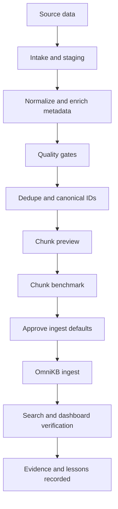

# Data Curation Pipeline Strategy (OmniKB)

This document is the **canonical strategy** for how we curate, prepare, and govern data before and after it enters the OmniKB vector store. It complements runbooks ([user-operations-guide.md](user-operations-guide.md), [benchmarking-playbook.md](benchmarking-playbook.md)) by answering **why** we do things and **what** quality and identity rules we want, while keeping implementation details honest about the **current** codebase.

**Audience:** operators, maintainers, and anyone changing ingestion, chunking, or corpus policy.

---

## 1) Data governance principles

1. **Provenance** — Every indexed unit should be traceable to a source path, content fingerprint, and the pipeline configuration that produced it (chunk strategy, sizes, embedding model).
2. **Ownership** — Clarify who may add or change corpus files; avoid anonymous drops into `data/sources` without review.
3. **Allowed content** — Prefer UTF-8 text, focused topics per file, and minimal boilerplate (see [user-operations-guide.md](user-operations-guide.md) preparation checklist).
4. **Sensitive data** — Treat the corpus as potentially sensitive: PII, credentials, and regulated data should be redacted *before* ingest unless explicitly approved.
5. **Reproducibility** — Use pinned sample data and recorded hashes ([sample-data-evidence.md](sample-data-evidence.md)); keep benchmark JSON and notes when defaults change.
6. **“Do not index garbage”** — Empty PDFs, encoding-mangled text, or duplicate copies under different paths inflate noise and cost; gate at intake or accept explicit duplication policy.

---

## 2) Curation lifecycle (recommended)

| Stage | Purpose | OmniKB touchpoints today |
|-------|---------|---------------------------|
| Intake / staging | Copy or sync files into a controlled area before production ingest. | Host `data/sources` (bind-mounted read-only into API per [docker-compose.yml](../docker-compose.yml)). |
| Normalize | UTF-8, consistent line endings, heading structure for Markdown, sidecars for non-text media. | Loader: `.md`/`.txt` UTF-8 with `errors="ignore"`; `.pdf` via `pypdf` page text. |
| Validate | Size, readability, secret scan, spot queries. | Operator + `/ingest/preview`; smoke scripts in README. |
| Dedupe / IDs | Decide canonical document identity vs path copies. | **Today:** idempotent **per `source_path`** only (see §3). |
| Preview / benchmark | Tune chunk strategy and sizes on *your* corpus. | `POST /ingest/preview`, [benchmarking-playbook.md](benchmarking-playbook.md), `scripts/benchmark_chunking.py`. |
| Approve | Record chosen defaults and rationale. | Env/settings + playbook notes + optional [devtools/error-tracking-db.md](../devtools/error-tracking-db.md). |
| Ingest | Embed and upsert to Qdrant. | `POST /ingest/path`. |
| Verify | Queries, corpus summary, dashboards. | `POST /query`, `/corpus/summary`, `/corpus/sources`. |
| Evidence | Retrospectives and regressions. | `devtools/error-tracking-db.md`, dated benchmark JSON under `data/processed/benchmarks/` (local; gitignored except layout). |

---

## 3) Deduplication, idempotency, and identity

### 3.1 Current behavior (path-level idempotency)

- **Re-ingest of the same file path** deletes existing points for that `source_path`, then upserts fresh chunks (see [`ingestion_service.py`](../src/omnikb/services/ingestion_service.py)). Repeated runs do not accumulate duplicate points for the same path (see [`test_ingestion_idempotency.py`](../tests/test_ingestion_idempotency.py)).
- **Point ID** is a deterministic UUIDv5 from `source_path`, `content_hash`, and chunk index (see code: the UUID input string does **not** include `chunk_strategy`; strategy is stored on the payload). Each ingest run replaces all points for that path first, so you do not retain mixed-strategy rows for the same file.
- **`document_id`** in payload is SHA-256 of the **source path string**, not of file bytes — two different paths to identical content get **different** `document_id` values.

### 3.2 What is *not* implemented today

- **No corpus-wide deduplication** by `content_hash`: the same bytes under two paths produce two independent document streams in the index.
- **No skip-if-unchanged** short path: every ingest re-embeds and replaces points for that path (delete then upsert).

### 3.3 Target identity model (strategy)

Use this mental model when designing policies and future code:

| Concept | Meaning |
|---------|---------|
| **Source path** | Operational key for replace-on-reingest today. |
| **Content hash** | Fingerprint of extracted **text** after load (SHA-256 hex in payload). |
| **Canonical document ID** (future) | Stable ID for “one logical document” across moves/renames/copies — e.g. content-addressed or registry-assigned. |
| **Chunk identity** | Today: stable id from path + content hash + index; `chunk_strategy` recorded in payload (align strategy changes with full re-ingest for that path). |
| **Corpus version** (future) | Explicit version when embedding model, chunk strategy, or normalization changes — enables safe re-embed and comparison. |

---

## 4) Metadata schema (current + recommended extensions)

### 4.1 Stored on each Qdrant point today (payload)

Includes among others: `document_id`, `chunk_index`, `source_path`, `file_type`, `content_hash`, `content_preview`, `text`, `updated_at` / `updated_at_ts`, `indexed_at` / `indexed_at_ts`, `chunk_strategy`.

**Important nuance:** `updated_at` is set at load time to **current UTC** in the document loader, **not** filesystem `mtime`. Do not rely on it for “when did the file last change on disk” until that is implemented (see backlog).

### 4.2 Recommended future fields (governance / migrations)

- `source_mtime` / `source_size_bytes` — from filesystem when available.
- `ingest_pipeline_version` — semver or git SHA of the API image.
- `embedding_model` — echo of model id used for the vector.
- `normalization_profile` — e.g. PDF extraction version, line-ending policy.
- `canonical_document_id` — once dedupe/registry exists.

Naming: prefer **snake_case** keys aligned with API query filters in [schemas.py](../src/omnikb/api/schemas.py).

---

## 5) Chunking and tokenization strategy (tied to benchmarks)

### 5.1 Strategies in code

Defined in [`chunking.py`](../src/omnikb/domain/chunking.py):

| Strategy | Role |
|----------|------|
| `recursive_char_v1` | Default in [settings.py](../src/omnikb/config/settings.py): character windows with separators and overlap. Good general baseline. |
| `markdown_structure_v1` | Splits on Markdown headings first, then recursive chunking within sections — **recommended** for Markdown-heavy corpora in [benchmarking-playbook.md](benchmarking-playbook.md). |
| `token_recursive_v1` | Whitespace-normalized “pseudo-token” split then recursive chunking — **not** a full subword tokenizer; useful label for experiments, not “true tokens”. |

### 5.2 Defaults vs playbook

- **Runtime defaults** (unless overridden by environment): `chunk_strategy=recursive_char_v1`, `chunk_size=450`, `chunk_overlap=60` ([settings.py](../src/omnikb/config/settings.py)).
- **Documented tuning default** from benchmarks/playbook: `markdown_structure_v1`, `500`, `60` — **align** env/settings with playbook when you adopt that default corpus-wide.

### 5.3 How to choose

1. Run `python scripts/benchmark_chunking.py` on a representative slice of `data/sources`; compare `summary` keys: `avg_chunks_per_file`, `avg_elapsed_ms_per_file`, `avg_chunk_chars` ([benchmarking-playbook.md](benchmarking-playbook.md)).
2. Use `POST /ingest/preview` before full ingest to inspect chunk boundaries on real files.
3. Run retrieval smoke (`scripts/smoke-test.ps1`) after changing defaults.
4. Record the decision (which corpus, which metrics, which tradeoff) in evidence docs or the error-tracking DB.

### 5.4 Chunk quality heuristics (practice)

- Prefer **sections under headings** for notes and runbooks (Markdown).
- Keep **one main topic per file** where possible to reduce cross-talk in embeddings.
- Avoid **huge single-line blobs** (minimize paste dumps); break into files or headings.
- Treat **PDF** output as noisy: plan human spot-checks or alternative extractors in backlog.

---

## 6) Migration, compression, and filesystem (theory + practice)

### 6.1 Compression

- **Archival / transfer:** gzip/zstd/tar archives are fine for **moving** corpora between machines; verify checksums after expand.
- **Active ingest folder:** keep the **mounted source corpus uncompressed** for simplicity and predictable `read_text` / PDF access; compress **exports** or **backups** instead.
- **Recompressing already-compressed** media rarely helps; focus on text and structured exports.

### 6.2 NTFS vs ext4 and Docker on Windows

- OmniKB commonly runs as **Linux containers** on **Windows** with bind mounts: host NTFS (or ReFS) backs `./data/sources`, `./data/qdrant`, `./data/processed` ([docker-compose.yml](../docker-compose.yml)).
- **Line endings and symlinks:** Git and editors may normalize CRLF; symlinks on Windows can behave differently than on Linux — treat “same repo on Linux VM” as a validation target if you depend on symlinks.
- **Case sensitivity:** Linux paths inside the container are case-sensitive; Windows Explorer is not — avoid relying on case-only distinctions for `source_path`.
- **Moving data ext4 ↔ NTFS:** prefer **checksum-verified copy** (e.g. `robocopy` / `rsync` with verify, or explicit SHA-256 manifest). Re-ingest after large moves if paths change so metadata stays coherent.

### 6.3 Cost / latency tradeoffs (high level)

| Choice | Upside | Downside |
|--------|--------|----------|
| Larger chunks | Fewer points, fewer embed calls | Worse precision, more irrelevant context in hits |
| Smaller chunks | Finer retrieval | More points, more storage, more embed CPU |
| Stronger / larger embedding models | Often better semantics | Slower embed, larger vectors, possible dimension change → collection migration |
| Re-ingest everything on each change | Simple mental model | Wastes compute; mitigated by skip-if-unchanged (backlog) |

---

## 7) Quality gates and evidence

1. **Sample corpus lock** — Three tracked files under `data/sources/` with known hashes ([sample-data-evidence.md](sample-data-evidence.md)); use after any ingestion or chunking change.
2. **Preview** — `/ingest/preview` on a subset (`limit_files`).
3. **Benchmark JSON** — `data/processed/benchmarks/chunking-benchmark-latest.json` (local artifact; playbook describes retention).
4. **Smoke** — `scripts/smoke-test.ps1`, API health, optional Playwright smoke from `web/` (see user guide).
5. **Dashboards** — `/corpus/summary` and `/corpus/sources` for sanity; note scroll limits in store implementation mean **very large** collections may need pagination work for exact counts (backlog).
6. **Incidents** — [devtools/error-tracking-db.md](../devtools/error-tracking-db.md) for structured follow-up.

### 7.1 Automation scripts (repo)

| Script | Purpose |
|--------|---------|
| `python scripts/generate_corpus_manifest.py` | Emit `corpus-manifest-latest.json` (and optional `--dated-copy`) per [corpus-manifest-contract.md](corpus-manifest-contract.md). |
| `python scripts/validate_corpus.py` | Dry-run validation: unsupported files, empty extract, large files, duplicate `content_hash`; optional `--json-out`. |
| `python scripts/benchmark_chunking.py` | Chunk benchmarks; supports `--source-dir`, `--limit-files`, `--dated-copy`, `--output-name` (see [benchmarking-playbook.md](benchmarking-playbook.md)). |

Ingest API: `POST /ingest/path` accepts `skip_unchanged` (boolean) and `allow_quality_override` (boolean). **`POST /curation/validate`** runs the same checks without writing to Qdrant.

**Hard gate (implemented):** When `CURATION_GATE_ENABLED` is true, `IngestionService` calls `validate_corpus` / `validate_ingest_files` and `assert_curation_gate` before embedding. Failures raise `CurationGateError` → HTTP 422. Override requires `CURATION_ALLOW_OVERRIDE=true` and `allow_quality_override` on the request.

Details: [ingestion-and-curation-architecture.md](ingestion-and-curation-architecture.md).

---

## 8) Documentation map (user vs internal vs theory)

| Kind | Where | Use for |
|------|--------|---------|
| **User / operator** | [user-operations-guide.md](user-operations-guide.md) | Day-to-day ingest, search, troubleshooting. |
| **Strategy (this doc)** | [data-curation-pipeline.md](data-curation-pipeline.md) | Governance, identity, lifecycle, migration, backlog. |
| **Ingest + validation (implemented)** | [ingestion-and-curation-architecture.md](ingestion-and-curation-architecture.md) | Components, events, function map, 422 gate. |
| **Benchmarks** | [benchmarking-playbook.md](benchmarking-playbook.md), `scripts/benchmark_chunking.py` | Measurable chunking decisions. |
| **Evidence / samples** | [sample-data-evidence.md](sample-data-evidence.md) | Reproducible validation. |
| **Product vision / history** | [PROJECT-CHARTER.md](../PROJECT-CHARTER.md) | North star; may predate naming (“OmniStore” vs OmniKB). |
| **Internal engineering** | [internal-react-devtools-debugging-guide.md](internal-react-devtools-debugging-guide.md) | Frontend debugging only. |
| **Incidents** | [devtools/error-tracking-db.md](../devtools/error-tracking-db.md) | Postmortems and operational notes. |
| **Obsidian workflow** | [obsidian-vault-conventions.md](obsidian-vault-conventions.md), [obsidian-export-to-omnikb.md](obsidian-export-to-omnikb.md), [obsidian-templates-and-queries.md](obsidian-templates-and-queries.md) | Authoring, review, export boundary, templates. |
| **Non-text sidecars** | [content-sidecars.md](content-sidecars.md) | Media and other types via Markdown sidecars. |
| **Manifest contract** | [corpus-manifest-contract.md](corpus-manifest-contract.md) | JSON schema for generated corpus manifests. |
| **Scratch / local** | `internal_docs/` (gitignored) | Not part of the shared doc contract. |

**Theory vs practice:** RAG and chunking theory lives lightly in charter + [data/sources/sample-rag.md](../data/sources/sample-rag.md); **practice** is user guide + playbook + this strategy doc.

---

## 9) Engineering backlog (from strategy to code)

**Implemented in repo (partial):** corpus manifest generator + contract, dry-run validator with **frontmatter gate**, extended chunk benchmark CLI, filesystem `mtime`/size on payload, pipeline/version fields, `skip_unchanged`, **ingest hard gate** + `/curation/validate`, Obsidian workflow docs, CI workflow. Remaining items below.

Prioritized ideas aligned with gaps above:

1. **Filesystem metadata** — Set `updated_at` from `Path.stat().st_mtime` (or explicit sidecar) instead of always “now”.
2. **Skip unchanged** — If `content_hash` unchanged for a path, skip re-embed (optional flag).
3. **Canonical document ID + dedupe report** — Optional job listing duplicate `content_hash` across paths for operator merge/delete.
4. **Corpus version** — Stamp points or sidecar manifest when `embedding_model` or chunk defaults change; document re-embed procedure.
5. **Align defaults** — Single source of truth for default chunk strategy/size between [settings.py](../src/omnikb/config/settings.py) and [benchmarking-playbook.md](benchmarking-playbook.md) once policy is fixed.
6. **Scale** — Paginated scroll for `/corpus/sources` / summary; payload indexes in Qdrant for heavy filter workloads.
7. **Tokenization** — Optional real tokenizer dependency if `token_recursive_v1` should match model token boundaries.
8. **PDF quality** — Pluggable extractors, OCR path for scanned PDFs (long-term).

**Next extensibility targets:** optional UI toggle for `skip_unchanged`; a small `kb_ingest`-driven export script from an Obsidian vault to `data/sources`; paginated corpus APIs for very large collections; payload indexes in Qdrant for heavy filtered dashboards.

---

## 10) Related links

- [README.md](../README.md) — quick start and API list.
- [docker-compose.yml](../docker-compose.yml) — bind mounts for sources, processed, Qdrant storage.
