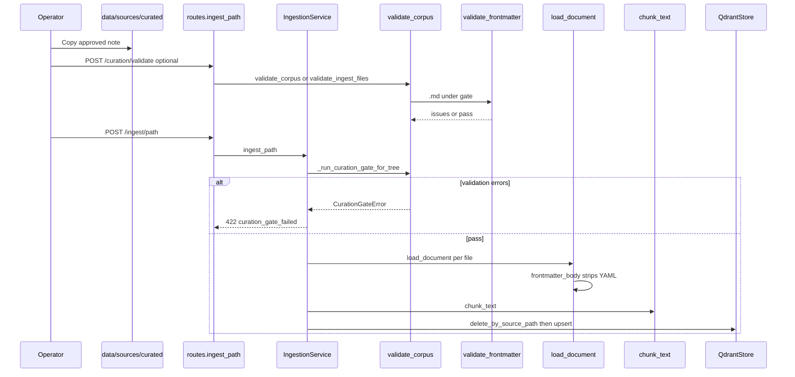

# Ingestion and curation architecture (implemented)

This document describes **how VECTORDB-BRAIN / OmniKB processes source files today**: components, validation gates, and the function-level path from disk to Qdrant. It complements [data-curation-pipeline.md](data-curation-pipeline.md) (policy) and [layered-knowledge-architecture.md](layered-knowledge-architecture.md) (roadmap).

## Runtime components

| Layer | Module / service | Responsibility |
|--------|------------------|----------------|
| HTTP | `src/omnikb/api/routes.py` | `/ingest/*`, `/curation/validate`, `/query`, corpus stats |
| Schemas | `src/omnikb/api/schemas.py` | Request bodies (`allow_quality_override`, curation validate DTOs) |
| Composition | `src/omnikb/app_state.py` | Wires `Settings` → `IngestionService`, `QueryService`, `QdrantStore` |
| Ingest use-case | `src/omnikb/services/ingestion_service.py` | Path resolution, **curation gate**, chunk, embed, upsert |
| Query use-case | `src/omnikb/services/query_service.py` | Vector search + payload filters |
| Load / discover | `src/omnikb/adapters/document_loader.py` | `discover_files`, `load_document`, `_read_text` (strips `.md` YAML) |
| Curation | `src/omnikb/curation/validate.py` | `validate_corpus`, `validate_ingest_files`, `validate_frontmatter`, `assert_curation_gate` |
| Frontmatter | `src/omnikb/curation/frontmatter.py` | `parse_frontmatter`, `frontmatter_body`, `as_bool` |
| Errors | `src/omnikb/curation/exceptions.py` | `CurationIssue`, `CurationGateError` |
| Chunking | `src/omnikb/domain/chunking.py` | `chunk_text`, strategies |
| Vectors | `src/omnikb/adapters/embedder.py`, `qdrant_store.py` | Embeddings, `upsert`, `delete_by_source_path` |
| CLI | `scripts/validate_corpus.py` | Same validation as API gate (dry-run, exit code 1 on errors) |

## Corpus layout (recommended)

| Path under `data/sources/` | Frontmatter gate | Typical use |
|----------------------------|------------------|-------------|
| `_samples/` or `sample-*` | Exempt | CI / smoke evidence |
| `staging/` | No | Obsidian export before promotion |
| `curated/` | **Yes** (Template 2.0.0) | Production ingest |
| Root `*.md` | No | Legacy samples, quick tests |

Gate roots default to the **`curated`** path segment (configurable via `CURATION_GATE_ROOTS`).

## Event: operator adds a new file

### A) Markdown with YAML frontmatter (curated path)



**Frontmatter checks** (`validate_frontmatter`) when `CurationPolicy.strict_frontmatter` is true:

| Code | Severity | Rule |
|------|----------|------|
| `missing_frontmatter` | error | Opening `---` YAML block |
| `kb_ingest_not_true` | error | `as_bool(kb_ingest) is True` |
| `note_not_finalized` | error | `note_finalized: true` |
| `kb_status_not_curated` | error | `kb_status: curated` |
| `ai_unverified` | error | If `ai_assisted`, then `ai_summary_verified: true` |
| `missing_summary` | warn | Non-empty `summary` |
| `missing_kb_reviewed_at` | warn | `kb_reviewed_at` set |
| `secret_pattern` | error | Regex scan on **full file** (body + frontmatter) |

**Indexing integrity:** Even when validation passes, `load_document` → `_read_text` uses `frontmatter_body()` so **YAML is not embedded** into chunk text or `content_hash` (only body text is indexed).

### B) Plain `.txt` under `curated/`

- No YAML gate; **`_scan_secrets`** runs on full text when path is under gate (`_validate_one_file`).
- `load_document` reads full file UTF-8 (`errors="ignore"`).
- Empty or whitespace-only extract → `empty_content` (error).

### C) `.pdf` under `curated/`

- No frontmatter gate (PDF has no YAML workflow).
- `load_document` → `pypdf` page text extraction (`normalization_profile` in settings).
- Failures → `load_failed`; empty extract → `empty_content`.

### D) Markdown at corpus root (not under `curated/`)

- Frontmatter **not** required; file ingests like a legacy sample.
- If frontmatter exists, it is still **stripped** from indexed text for `.md`.

## Event: validation-only (no ingest)

1. **CLI:** `python scripts/validate_corpus.py --root data/sources`
2. **API:** `POST /curation/validate` with `{"path":"/data/sources/curated","recursive":true}`

Both use `validate_corpus` / `validate_ingest_files` and return structured issues; CLI exits `1` when any **error**-severity issue exists.

## Event: ingest blocked (hard gate)

1. `IngestionService._run_curation_gate_for_tree` or `_run_curation_gate` builds a `ValidationReport`.
2. `assert_curation_gate` raises `CurationGateError` unless:
   - `curation_policy.gate_enabled` is false, or
   - Request includes `allow_quality_override: true` **and** `CURATION_ALLOW_OVERRIDE=true` in environment.

3. `routes._raise_ingest_error` maps to HTTP **422** with body:

```json
{
  "detail": {
    "code": "curation_gate_failed",
    "issues": [{ "severity": "error", "code": "...", "message": "...", "path": "..." }]
  }
}
```

## Event: re-ingest / idempotency

- `IngestionService._ingest_single` calls `QdrantStore.delete_by_source_path` then `upsert` for that `source_path`.
- Optional `skip_unchanged: true` skips re-embed when payload fingerprint matches (`_is_unchanged_in_store`).

## Configuration (environment)

See [.env.example](../.env.example):

| Variable | Default | Meaning |
|----------|---------|---------|
| `CURATION_GATE_ENABLED` | `true` | Enforce validation before ingest |
| `CURATION_GATE_ROOTS` | `curated` | Comma-separated subpaths (first segment) or scan root name |
| `CURATION_ALLOW_OVERRIDE` | `false` | Allow `allow_quality_override` on ingest requests |

Related pipeline settings: `EMBEDDING_MODEL`, `CHUNK_*`, `PIPELINE_VERSION`, `NORMALIZATION_PROFILE` (stored on each Qdrant point).

## Related docs

- [obsidian_vault/Template-2.0.0-Usage-Guide.md](../obsidian_vault/Template-2.0.0-Usage-Guide.md) — human lifecycle before export
- [data-curation-pipeline.md](data-curation-pipeline.md) — governance strategy
- [user-operations-guide.md](user-operations-guide.md) — operator commands
- [developer-guide.md](developer-guide.md) — engineering entry point
